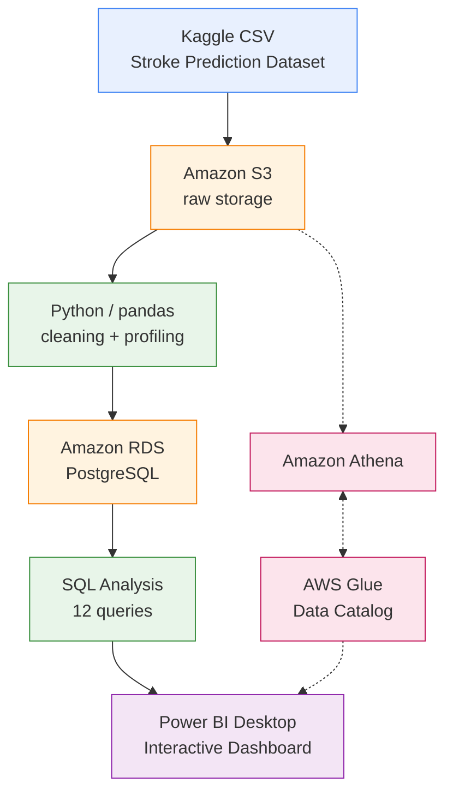
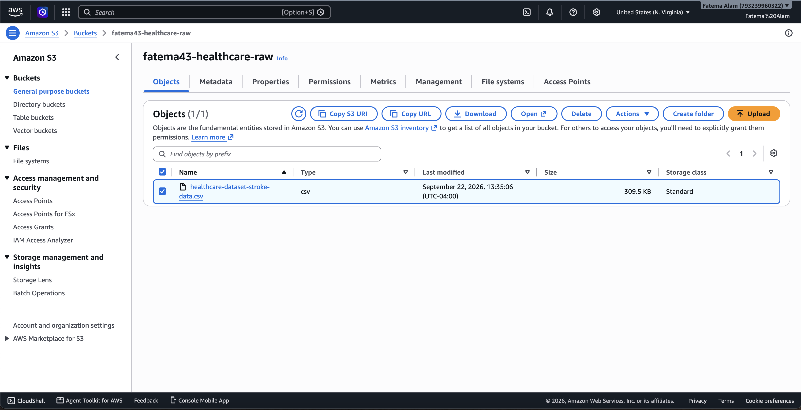
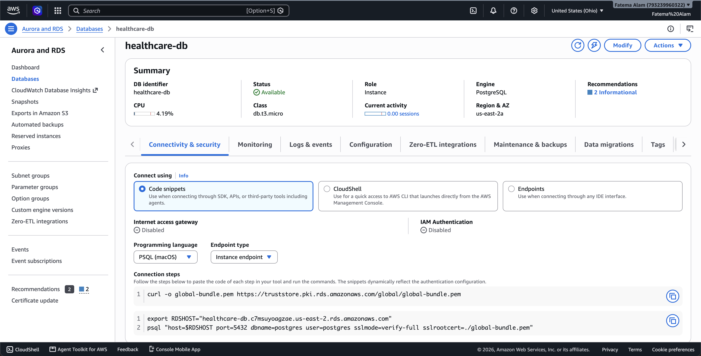
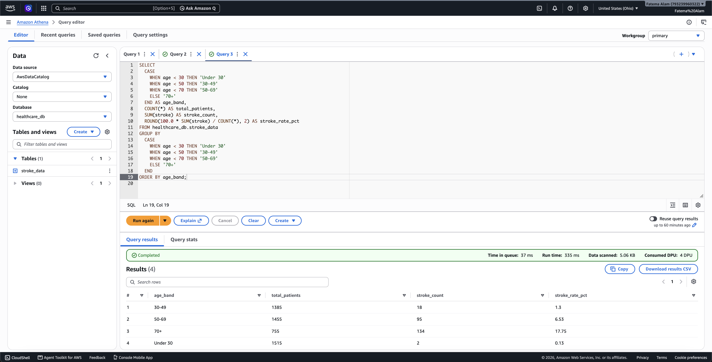
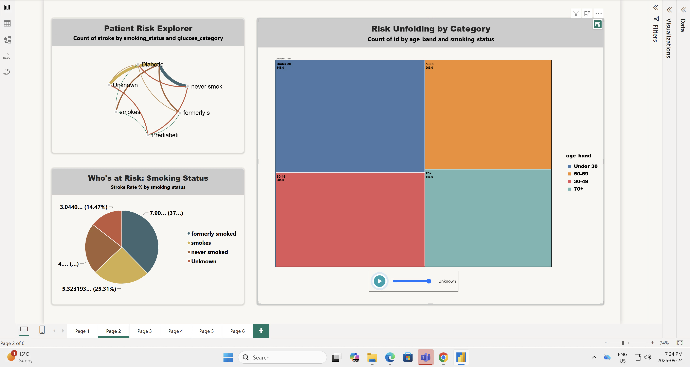
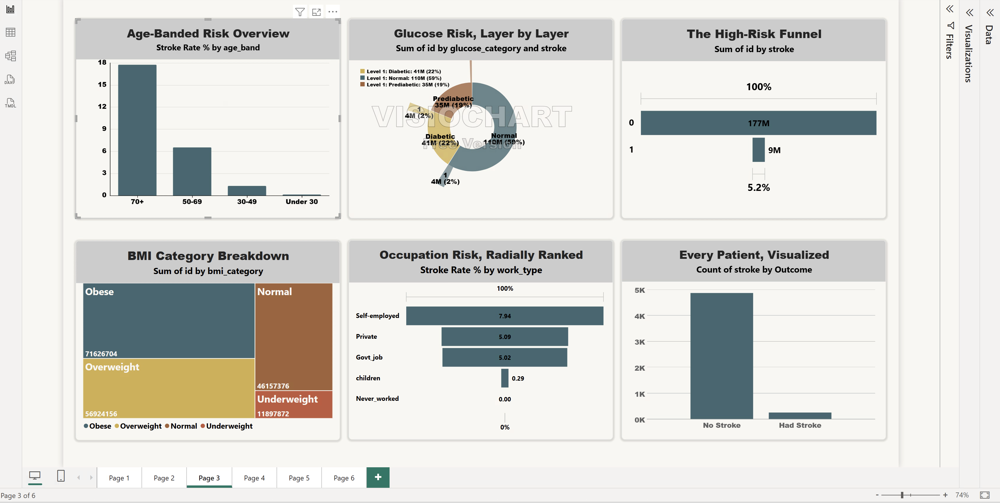
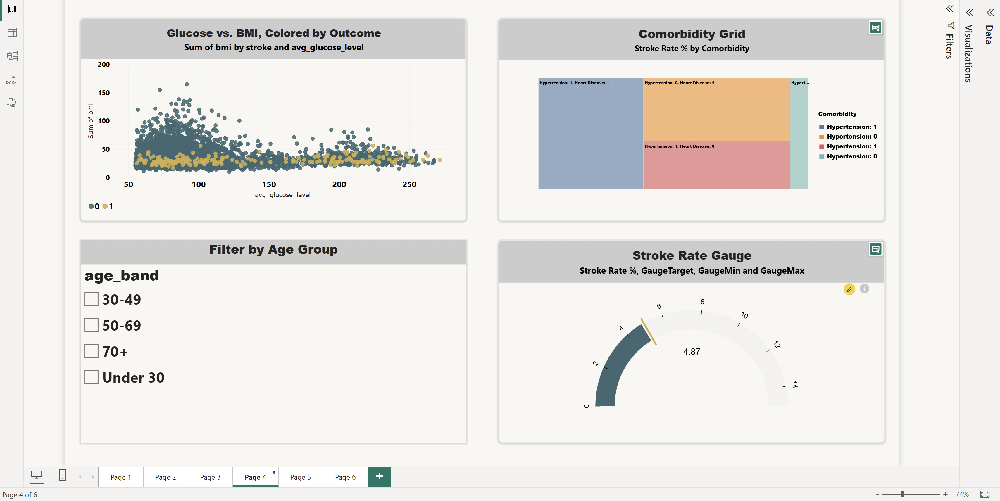
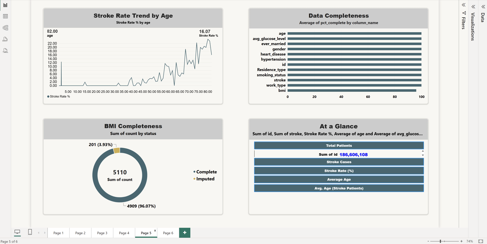
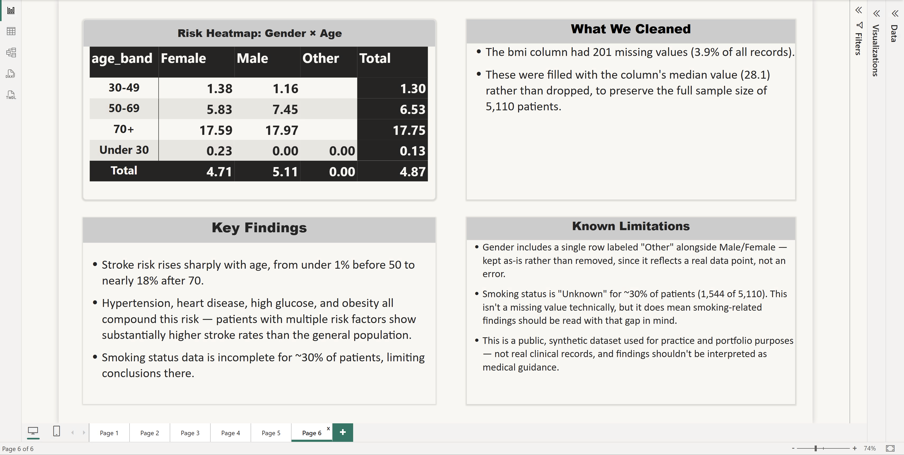

# AWS-S3-Athena-RDS-Power BI — Healthcare Stroke Risk Pipeline

## Project Overview

This project analyzes stroke risk factors from a 5,110-patient healthcare dataset using a fully cloud-based pipeline built on **AWS Free Tier** and visualized in **Power BI**. The goal was to build a working, end-to-end data solution — from raw data ingestion to an interactive analytics dashboard — using the same tools and workflow expected in a real data & AI solutions role: S3 for storage, Python for data cleaning, RDS (PostgreSQL) for structured SQL analysis, Athena/Glue for serverless querying, and Power BI for visualization. The result is a 6-page interactive dashboard uncovering clear, data-backed patterns in stroke risk — most notably that risk rises sharply with age and compounds significantly when hypertension, heart disease, high glucose, and obesity occur together — while staying transparent about the dataset's real limitations.

**Watch the walkthrough:** [AWS + Power BI: End-to-End Healthcare Data Pipeline](ADD-YOUR-LINKEDIN-VIDEO-LINK-HERE)

## Data Overview

- **Source:** [Stroke Prediction Dataset](https://www.kaggle.com/datasets/fedesoriano/stroke-prediction-dataset) (Kaggle, fedesoriano) — a public, synthetic healthcare dataset used for practice and portfolio purposes, not real clinical records.
- **Size:** 5,110 patient records, 12 columns (demographics, health indicators, and stroke outcome).
- **Fields:** id, gender, age, hypertension, heart_disease, ever_married, work_type, Residence_type, avg_glucose_level, bmi, smoking_status, stroke.

## Tech Stack

| Layer | Tool |
|---|---|
| Storage | Amazon S3 |
| Processing | Python (pandas, boto3) |
| Database | Amazon RDS (PostgreSQL, Free Tier) |
| Ad-hoc querying | Amazon Athena + AWS Glue Data Catalog |
| Analysis | SQL |
| Visualization | Power BI Desktop |
| Environment | VS Code, AWS CLI |

## Architecture



The core pipeline runs **S3 → Python → RDS → SQL → Power BI**, kept entirely within AWS Free Tier limits. Athena and Glue Data Catalog (dashed path above) were used in a separate, contained exercise to demonstrate serverless querying directly against S3.

## Data Profiling & Cleaning

Profiling was run before any cleaning to understand the real shape of the data (`scripts/clean_data.py`):

- 5,110 rows, 12 columns, **zero duplicate rows**.
- `bmi` was the only column with missing values: **201 missing (3.9%)** — filled with the column median (28.1) rather than dropped, to preserve the full sample size.
- `gender` includes a single row labeled `"Other"` alongside Male/Female — kept as-is, noted as a real data point rather than an error.
- `smoking_status` is `"Unknown"` for **~30% of patients** (1,544 of 5,110) — not a missing value technically, but a real information gap flagged in the analysis.

Full notes: [`docs/data_profiling_report.md`](docs/data_profiling_report.md)

## SQL Work

12 analytical queries were written and run directly against RDS (PostgreSQL), covering:

- Stroke rate by age band and by single-year age
- Stroke rate by smoking status, work type, and BMI/glucose category
- Hypertension × heart disease comorbidity breakdown
- Average glucose and BMI compared across stroke outcomes
- A high-risk population funnel (age 50+, comorbidities, high glucose)
- Top-line KPI summary (total patients, stroke rate, average age)

Queries handle a PostgreSQL-specific quirk (`ROUND()` requiring an explicit `numeric` cast on aggregate results) and use `GROUP BY`, `CASE WHEN`, `UNION ALL`, and aggregate functions throughout.

Full SQL: [`sql/sql_queries.sql`](sql/sql_queries.sql) · Runner script: [`scripts/analyze_data.py`](scripts/analyze_data.py)

## Power BI Dashboard

A 6-page interactive dashboard built from the RDS query results:

1. **Key Influencers & Risk Drill-Down** — what actually predicts a stroke, with a drillable decomposition tree
2. **Patient Risk Explorer** — smoking status and glucose category relationships, age-band breakdown
3. **Risk Overview** — age, glucose, occupation, BMI, and outcome breakdowns in one view
4. **Comorbidity Analysis** — scatter plot, comorbidity heatmap, live age-group filtering, stroke rate gauge
5. **Data Quality** — completeness tracking, BMI imputation breakdown, top-line KPIs
6. **Findings & Limitations** — gender/age heatmap, key findings, and an honest limitations summary

## Screenshots

### AWS Pipeline

| S3 — Raw Dataset Storage | RDS PostgreSQL — Database Overview |
|---|---|
|  |  |

| Athena — Stroke Rate by Age | Glue Data Catalog — Registered Table |
|---|---|
|  |  |

### Power BI Dashboard — All 6 Pages

| Page 1 — Key Influencers & Risk Drill-Down | Page 2 — Patient Risk Explorer |
|---|---|
|  |  |

| Page 3 — Risk Overview | Page 4 — Comorbidity Analysis & Gauge |
|---|---|
|  |  |

| Page 5 — Data Quality | Page 6 — Findings & Limitations |
|---|---|
|  |  |

*(See the full `/screenshots` folder for all dashboard pages and AWS console views.)*

## User Stories & Acceptance Criteria

**User Story 1** — As a data analyst, I want to clean and profile the raw dataset so that downstream analysis is based on trustworthy data.
- *Given* a raw CSV with missing values, *when* the cleaning script runs, *then* missing `bmi` values are imputed with the median and the cleaning decisions are documented.

**User Story 2** — As a stakeholder, I want to query patient data using SQL so that I can answer specific questions about stroke risk factors.
- *Given* cleaned data loaded into RDS, *when* a SQL query is run, *then* it returns an accurate, aggregated answer (e.g., stroke rate by age band) with correct type handling.

**User Story 3** — As a recruiter/reviewer, I want to explore the findings visually so that I don't have to read raw query output.
- *Given* the SQL results, *when* I open the Power BI dashboard, *then* I can interactively filter, drill down, and see the key risk patterns at a glance.

**User Story 4** — As a data-conscious viewer, I want to know the dataset's limitations so that I can judge how much to trust the findings.
- *Given* the completed analysis, *when* I view the Findings & Limitations page, *then* I see explicit documentation of missing data, outliers, and the synthetic nature of the dataset.

## Problems Faced & How They Were Solved

- **Accidentally provisioned Aurora PostgreSQL instead of standard RDS** during initial setup — Aurora isn't Free Tier eligible. Caught it early, deleted the cluster, and recreated it correctly as standard RDS PostgreSQL.
- **PostgreSQL type-casting error** (`ROUND(double precision, integer) does not exist`) — Postgres's `ROUND()` requires a `numeric` type for the precision argument; fixed by explicitly casting aggregate results with `CAST(... AS numeric)`.
- **Athena scanning query-result files as table data** — because the table's `LOCATION` pointed at the bucket root, Athena tried to read its own output CSVs as Parquet input. Fixed by separating source data (`/data/`) and query results (`/results/`) into distinct S3 prefixes.
- **TLS certificate validation failure connecting Power BI to RDS from a university lab VM** — the network's TLS inspection broke Power BI's built-in PostgreSQL connector's certificate chain validation. Resolved by connecting via the ODBC driver instead, with SSL mode set to `require`.
- **Marketplace visual field-well quirks** (e.g., Scatter Chart's Play Axis requiring a stable per-point identity field) — worked around by using slicers for interactivity instead of forcing animation where the visual didn't support it well.

## Data Limitations

- `bmi` had 201 missing values (3.9%) — filled with the column median (28.1) rather than dropped, to preserve the full sample.
- `gender` includes a single row labeled "Other" alongside Male/Female — kept as-is, noted as a single outlier rather than an error.
- `smoking_status` is "Unknown" for ~30% of patients (1,544 of 5,110) — not a missing value technically, but a real gap that limits confidence in smoking-related conclusions.
- This is a public, synthetic dataset, not real clinical records — findings are for portfolio/practice purposes and should not be interpreted as medical guidance.

## Key Findings

- Stroke risk rises sharply with age — from under 1% before age 50 to nearly 18% after age 70.
- Hypertension, heart disease, high glucose, and obesity all compound stroke risk; patients with multiple risk factors show substantially higher rates than the general population.
- Self-employed workers show a notably higher stroke rate (7.94%) compared to other occupation types.
- Smoking status data gaps limit how far smoking-related conclusions can be drawn.

## Future Work

- Automate the S3 → RDS load with a scheduled AWS Lambda function instead of a manually-run script.
- Replace the manual Athena table registration with a proper Glue Crawler for a fuller ETL demonstration.
- Add a simple classification model (logistic regression) to complement the descriptive analysis with a predictive angle.
- Connect Power BI directly to RDS via a scheduled refresh (Power BI Service) instead of manual refreshes from a local machine.

## Repo Structure

```
├── data/                — raw dataset
├── scripts/              — Python: cleaning, RDS load, SQL analysis
├── sql/                  — standalone SQL queries
├── docs/                 — data profiling report
└── screenshots/          — AWS console + Power BI dashboard screenshots
```